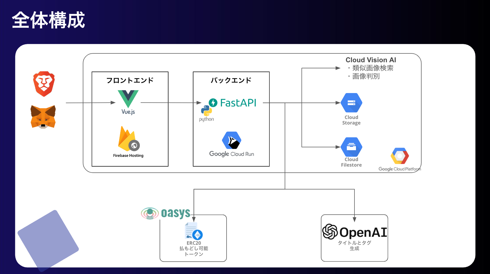

🎗 2023年/AI x Cripto Hackathon Top30 Product 選出
- [参考](https://docs.google.com/spreadsheets/d/1ftUsPOCXQOBegM4b-rdlADiXoxt-gGXbAkwy0J50sJA/edit#gid=130562828)

# LIT ART MARKET

LIT ART MARKET のバックエンドサーバーです。本アプリケーションには、下記の URL からアクセスしてください

- [LIT ART MARKET](https://hackathon-sandbox-389814.web.app/mypage)

本アプリケーションについては下記の URL を参照してください

- [Lit Art Market | AKINDO](https://app.akindo.io/communities/1PLX1jmpPUz2nZJL/products/peRXkK3QziGV6AmJ)

## 全体像

LIT ART MARKET は下記のような構成になっています。



上記の全体構成のうち、フロントエンド以外は本リポジトリの担当範囲です。  
フロントエンドは、下記のリポジトリで構築されています。

- [GitHub - teritamas/lit-art-market-frontend](https://github.com/teritamas/lit-art-market-frontend)

## 概要

本リポジトリで構築される API エンドポイントと、その API の SwaggerDocs は下記の通りです。

- https://aixcript-hackathon-server-ez5q3zuvrq-an.a.run.app/
- [SwaggerDocs](https://aixcript-hackathon-server-ez5q3zuvrq-an.a.run.app/docs)

## Quick Start

### 1. 前準備

TBD

### 2. コントラクトのデプロイ

TBD

### 3. サーバーの起動

はじめに必要ライブラリと Python の環境を用意する

```sh:
poetry install
```

その後、下記のコマンドでサーバーを起動する

```sh:
poetry run uvicorn app.main:app --host 0.0.0.0 --port 8080 --reload
```
